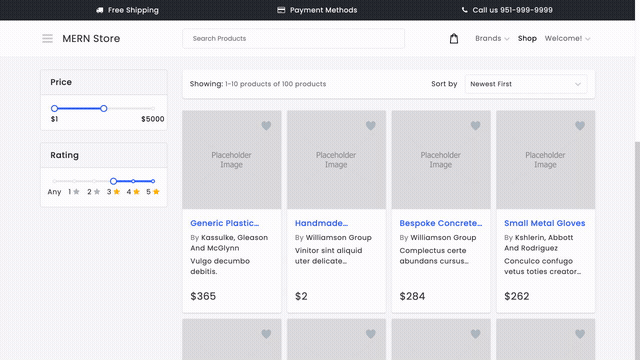

# Demo Recorder

Give Claude Code a goal like *"record a demo of filtering products by
rating and checking out"* and it will read your app's code, work out the
click-by-click flow itself, drive a real browser through it, and hand you
back a finished screen-recording — cursor, highlights, zoom, and all. No
one hand-writes the steps.

**How it works:** this repo is not a recorder you run directly. It's an
[MCP](https://modelcontextprotocol.io) server that gives Claude Code a
small set of browser tools (open a page, see what's on it, click, type,
verify, save the video). Claude Code supplies the intelligence — it reads
your codebase to figure out routes and button labels, decides the order of
steps, watches each tool's result, and retries with a different approach
when something doesn't work. This repo only provides the hands; the coding
agent is the brain.

## See it in action

A single prompt — *"filter products rated 4★+, add two to cart, remove one,
verify the cart"* — with no scripted steps, produced this:



That's a 14-second excerpt of the full 56-second recording — the slider
filter, two add-to-cart actions, a removal, and a final on-screen
verification, start to finish.

To watch the whole thing: open
[`docs/demo-rating-filter-checkout.mp4`](docs/demo-rating-filter-checkout.mp4)
**on GitHub's website** (not through a markdown link click, which only
downloads it) — navigating to the file's own page there loads a real
video player with the complete recording. Or after cloning, just open the
file directly:

```bash
open docs/demo-rating-filter-checkout.mp4   # macOS
```

## What you're testing

1. **Zero-script automation** — no one wrote "click X, then click Y" for
   this task anywhere. Claude Code read the target app's source and
   decided the flow live.
2. **Self-correction** — if a click misses, the tool returns the page's
   current state and Claude Code adjusts, rather than the whole run
   failing silently.
3. **Watchable output** — a visible cursor, a highlight box before each
   action, and an optional zoom-in on the target, so the result is an
   actual explainer video, not a raw automation log.

## Repository layout

```
demo-recorder/
├── src/
│   ├── mcp-server.ts       MCP server entrypoint — registers all tools below
│   ├── session-manager.ts  Tracks the live Playwright browser/page per session
│   ├── snapshot.ts         Reads visible buttons/links/inputs/sliders off the page
│   ├── overlay.ts          Injects the fake cursor, highlight box, and zoom effect
│   ├── recorder.ts         Starts/stops video recording, saves the .webm
│   ├── log.ts              Writes a plain-text step log alongside each video
│   └── config.ts           Reads SITE_URL / HEADLESS from .env
├── docs/                   Sample recording + GIF preview (this README's demo)
├── output/                 Where your own recordings and logs land (gitignored)
├── .env.example            Copy to .env and adjust if needed
└── package.json
```

## Prerequisites

- Node.js 18+
- [Claude Code](https://claude.com/claude-code) installed and working
- A target web app running locally that you want to record (any app —
  this was built and tested against a local MERN ecommerce storefront,
  but nothing here is specific to it)
- Google Chrome/Chromium (installed automatically in setup below)

## Setup

```bash
git clone https://github.com/dakshilkanakia/demo-recorder.git
cd demo-recorder
npm install
npx playwright install chromium
cp .env.example .env
```

`.env` just needs your target app's URL:

```text
SITE_URL=http://localhost:8080
HEADLESS=false
```

`HEADLESS=false` opens a real visible browser window so you can watch the
recording happen live; set it to `true` for silent/background runs.

**Start your target app first** — this tool records against a real
running site, it doesn't stand one up for you.

## Register the MCP server with Claude Code

From this repo's folder:

```bash
claude mcp add demo-recorder -- npx tsx "$(pwd)/src/mcp-server.ts"
```

Verify it connected:

```bash
claude mcp list
```

You should see `demo-recorder` listed as connected.

## Run a test recording

Open a Claude Code session **in the folder of the app you want to
record** (so Claude Code can read that app's source), and give it a goal
in plain English. For example, against a typical ecommerce app:

```
Using the demo-recorder MCP tools, explore this codebase and record a
demo video of adding a product to cart on http://localhost:8080.
```

or something with real branching, to test the self-correction more:

```
Using the demo-recorder MCP tools, filter products to 4 stars and up,
add the first two matching products to cart, remove one of them, and
verify the cart shows exactly one item. Record this as a video.
```

Claude Code will:
1. Read your app's routes/components to find the actual flow.
2. Call `start_session` to open a recorded browser.
3. Loop `snapshot` → `click`/`fill`/`goto` → `assert_visible`, adjusting
   whenever a step doesn't work as expected.
4. Call `finish_session` to save the video.

Check the result:

```bash
ls output/videos   # your new .webm recording
ls output/logs     # a plain-text log of every step taken
```

## Tools available to Claude Code

| Tool | Purpose |
|---|---|
| `start_session` | Launch a recorded browser session at a URL |
| `snapshot` | List visible links, buttons, inputs, checkboxes, radios, sliders on the current page |
| `click` | Click an element by role + accessible name (`nth` to disambiguate duplicates, `zoom` to emphasize) |
| `fill` | Fill a text field by name (same `nth` / `zoom` options) |
| `focus` | Focus an element without clicking — used for slider handles |
| `press_key` | Send a keyboard key (Enter, Tab, arrow keys, Escape…) — e.g. to move a slider after `focus` |
| `goto` | Navigate to a path or URL |
| `assert_visible` | Verify text is visible, to confirm a step actually worked |
| `finish_session` | Save the video + run log, close the browser |

Full descriptions and parameters are in [`src/mcp-server.ts`](src/mcp-server.ts).

## Known limits (be aware of these when testing)

- **No login/session persistence** — every recording starts from a fresh
  browser. Fine for public flows; a task requiring login will need to log
  in as part of the recorded flow itself.
- **Single session at a time** — one recording runs at a time; no
  parallel recordings yet.
- **Best-effort element matching** — `click`/`fill` match by accessible
  role and name. An app with no labels on its interactive elements (poor
  accessibility markup) will be harder to drive reliably.
- **`.webm` output** — recordings save as `.webm`. The sample in `docs/`
  is also provided as `.mp4` for easier playback; converting your own
  recordings the same way just needs `ffmpeg -i input.webm output.mp4`.

## Troubleshooting

- **`claude mcp list` doesn't show `demo-recorder` as connected** — re-run
  the `claude mcp add` command from inside this repo's folder, and confirm
  `npx tsx src/mcp-server.ts` runs without error on its own first.
- **Tool calls fail immediately** — make sure your target app is actually
  running and reachable at the `SITE_URL` in `.env` before starting a
  session.
- **Clicks land on the wrong element** — pass `nth` (the tool errors will
  show you the available matches and their indices when a click fails).
